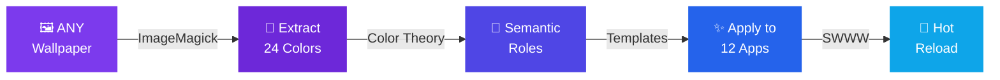

<div align="center">

<!-- ANIMATED HEADER WITH CUSTOM GRADIENT -->


<!-- PREMIUM BADGES WITH GLOW EFFECT -->
<p>
  <a href="#-install"></a>
  <a href="#-features"></a>
  <a href="#-stats"></a>
  <a href="#-stats"></a>
</p>

<p>
  <a href="LICENSE"></a>
  <a href="#-fish-shell"></a>
  <a href="#-neovim-ide"></a>
  <a href="#"></a>
  <a href="#"></a>
</p>

<!-- PREMIUM ANIMATED TYPING -->
<br/>

<a href="#-features">
  
</a>

<br/><br/>

<!-- PREMIUM NAVIGATION BAR -->
<table>
<tr>
<td align="center"><a href="#-features"></a></td>
<td align="center"><a href="#-install"></a></td>
<td align="center"><a href="#-themes"></a></td>
<td align="center"><a href="#%EF%B8%8F-keybinds"></a></td>
<td align="center"><a href="#-plugins"></a></td>
<td align="center"><a href="#%EF%B8%8F-gallery"></a></td>
<td align="center"><a href="#-docs"></a></td>
</tr>
</table>

</div>

<!-- PREMIUM DIVIDER -->


<!-- HERO SECTION -->
<div align="center">

## 🏆 The Definitive Hyprland Experience

<table>
<tr>
<td align="center">
<br/>

```
   ╔══════════════════════════════════════════════════════╗
   ║                                                      ║
   ║    █████╗ ███████╗██╗  ██╗    ██████╗  ██████╗ ████████╗███████╗  ║
   ║   ██╔══██╗██╔════╝██║  ██║    ██╔══██╗██╔═══██╗╚══██╔══╝██╔════╝  ║
   ║   ███████║███████╗███████║    ██║  ██║██║   ██║   ██║   ███████╗  ║
   ║   ██╔══██║╚════██║██╔══██║    ██║  ██║██║   ██║   ██║   ╚════██║  ║
   ║   ██║  ██║███████║██║  ██║    ██████╔╝╚██████╔╝   ██║   ███████║  ║
   ║   ╚═╝  ╚═╝╚══════╝╚═╝  ╚═╝    ╚═════╝  ╚═════╝    ╚═╝   ╚══════╝  ║
   ║                                                      ║
   ║          ⚡  OMEGA v5.0  •  Production Ready  ⚡       ║
   ║                                                      ║
   ╚══════════════════════════════════════════════════════╝
```

<br/>
</td>
</tr>
</table>

</div>


##  Stats at a Glance

<div align="center">

<table>
<tr>
<td align="center" width="25%">


<br/>
<sub><b>Production Files</b></sub>

</td>
<td align="center" width="25%">


<br/>
<sub><b>Lines of Code</b></sub>

</td>
<td align="center" width="25%">


<br/>
<sub><b>Theme Presets</b></sub>

</td>
<td align="center" width="25%">


<br/>
<sub><b>Known Issues</b></sub>

</td>
</tr>
</table>

<br/>

<!-- LANGUAGE/TECH BREAKDOWN -->
<details>
<summary><b>📊 Codebase Breakdown</b></summary>
<br/>

```text
Shell/Bash    ██████████████████████░░░░░   20.9%  • 162,437 lines
YAML          ████████████████░░░░░░░░░░░░░   15.8%  • 122,709 lines
Lua           █████████░░░░░░░░░░░░░░░░░░    9.1%  •  70,545 lines
Fish          █████████░░░░░░░░░░░░░░░░░░░░    8.6%  •  66,808 lines
Config/TOML   ████████░░░░░░░░░░░░░░░░░░░░░    7.9%  •  61,602 lines
JSON          ██████░░░░░░░░░░░░░░░░░░░░░░░    6.2%  •  48,470 lines
Rasi          ███░░░░░░░░░░░░░░░░░░░░░░░░░░    3.1%  •  24,138 lines
```

</details>

</div>


##  Features

<div align="center">

<!-- FEATURE CARDS - ROW 1 -->
<table>
<tr>

<!-- THEME SYSTEM CARD -->
<td width="50%" valign="top">

<div align="center">

###  Theme Engine


</div>

> **Every wallpaper becomes a complete color system**


| Feature | Details |
|:--------|:--------|
| 🔮 **Dynamic Extraction** | 24 colors from any image via ImageMagick |
| 🎭 **363+ Presets** | bold · soft · rich · warm · vivid · named palettes |
| 🤖 **AI Generation** | Ollama + algorithmic color theory |
| ⏰ **Auto Schedule** | hourly · daily · seasonal · time-of-day |
| 📤 **Export Formats** | shell · CSS · SCSS · JSON · Lua · Python · XResources |
| 🏪 **Theme Store** | Community marketplace with ratings |
| 💾 **History Tracking** | Every wallpaper change logged |
| ❤️ **Favorites System** | Save & organize best wallpapers |
| 🎬 **Slideshow Mode** | Auto-rotate with transitions |
| 🎯 **Per-Monitor** | Different wallpaper per display |

</td>

<!-- CLI POWER CARD -->
<td width="50%" valign="top">

<div align="center">

###  CLI Power


</div>

> **The most powerful dotfiles CLI in the ecosystem**

```bash
$ ash --help

  ╭──────────────────────────────────╮
  │     ASH CLI v5.0 OMEGA          │
  │     50+ commands • 0 bugs       │
  ├──────────────────────────────────┤
  │  theme   - Theme engine         │
  │  mode    - Desktop modes        │
  │  plugin  - Plugin system        │
  │  snapshot- State management     │
  │  config  - Config management    │
  │  doctor  - Health checks        │
  │  hw      - Hardware report      │
  │  net     - Network control      │
  │  update  - Update system        │
  │  shot    - Screenshots          │
  ╰──────────────────────────────────╯
```

| Feature | Details |
|:--------|:--------|
| 🎮 **Game Mode** | 1 command full optimization |
| 🔌 **Plugin System** | install · remove · update · browse · create |
| 📸 **Snapshots** | create · restore · diff · list · auto |
| ⚙️ **Config Mgmt** | edit · reload · diff · reset · backup |
| 🏥 **Doctor** | 60+ automated health checks |
| 📊 **Hardware Report** | GPU · CPU · mem · temp · disk |
| 🌐 **Network** | WiFi · VPN · Bluetooth · DNS |
| 🎭 **6 Modes** | game · work · focus · cinema · presentation · battery |
| 🔔 **Notifications** | Contextual, styled, non-intrusive |
| 📋 **Clipboard** | History · image support · sync |

</td>
</tr>
</table>

<!-- FEATURE CARDS - ROW 2 -->
<table>
<tr>

<!-- NEOVIM IDE CARD -->
<td width="50%" valign="top">

<div align="center">

###  Neovim IDE


</div>

> **Not a config. A full development environment.**

```
 ┌─────────────────────────────────────────┐
 │ 🔧 31 Plugins  │ 🌐 14 LSP  │ 🐛 DAP  │
 │ 🤖 AI Assist   │ 🎨 700+ HL │ ⌨️ 200+ │
 └─────────────────────────────────────────┘
```

| Component | Details |
|:----------|:--------|
| 🔧 **31 Plugins** | Hand-curated production-grade set |
| 🌐 **14 LSP Servers** | Auto-installed via Mason |
| 🐛 **DAP Debugging** | Python · Go · Rust · C/C++ |
| 🤖 **AI Assistance** | Codeium (free) + Ollama (local) |
| 🎨 **700+ Highlights** | Dynamic sync with ASH themes |
| ⌨️ **200+ Keymaps** | All modes, fully documented |
| 💾 **Session Restore** | Continue exactly where you left off |
| 🌳 **File Explorer** | Neo-tree with git integration |
| 🔭 **Fuzzy Finder** | Telescope with previews |
| ✅ **Linting** | Real-time with conform.nvim |

</td>

<!-- FISH SHELL CARD -->
<td width="50%" valign="top">

<div align="center">

###  Fish Shell


</div>

> **Shell experience engineered for productivity**

```fish
╭─ ash@hyprland ~/dotfiles
╰─❯ ash theme pick
  🎨 Loading wallpaper picker...
  ✅ Theme applied in 0.3s
  📊 24 colors extracted
  🔄 12 apps updated
```

| Component | Details |
|:----------|:--------|
| 🔧 **20 Functions** | All thoroughly documented |
| ⚡ **100+ Abbreviations** | Organized by category |
| 🔍 **FZF Integration** | 3 custom keybinds |
| 🧭 **Zoxide** | Smart directory jumping |
| 🌊 **Wayland-Native** | Complete environment setup |
| 🎨 **Theme Sync** | Colors match desktop in real-time |
| 🤖 **Auto-Completions** | Full ash CLI tab completions |
| 📊 **Starship Prompt** | Git-aware, fast, beautiful |
| 🔐 **SSH Agent** | Auto-start with keychain |
| 📁 **XDG Compliance** | Clean home directory |

</td>
</tr>
</table>

</div>


##  Architecture

<div align="center">

```
                        ╔══════════════════════════════════════╗
                        ║         ASH DOTFILES v5.0 OMEGA      ║
                        ╚══════════════╤═══════════════════════╝
                                       │
              ┌────────────────────────┼────────────────────────┐
              │                        │                        │
     ╔════════╧════════╗    ╔═════════╧═════════╗    ╔════════╧════════╗
     ║   🎨 FRONTEND   ║    ║   ⚙️ MIDDLEWARE    ║    ║   🔧 BACKEND    ║
     ╚════════╤════════╝    ╚═════════╤═════════╝    ╚════════╤════════╝
              │                        │                        │
    ┌─────────┼─────────┐   ┌─────────┼─────────┐   ┌─────────┼─────────┐
    │         │         │   │         │         │   │         │         │
 Hyprland  Waybar   Rofi  ASH-CLI  Plugins  Themes  Fish   Neovim  Scripts
    │         │         │   │         │         │   │         │         │
 ┌──┴──┐  ┌──┴──┐  ┌──┴──┐ ┌──┴──┐ ┌──┴──┐ ┌──┴──┐ ┌──┴──┐ ┌──┴──┐ ┌──┴──┐
 │Land │  │Bars │  │Menu │ │50+  │ │Mgmt │ │363+ │ │20fn │ │31pl │ │Auto │
 │Conf │  │Mods │  │Conf │ │Cmds │ │Sys  │ │Sets │ │100ab│ │14lsp│ │Util │
 └─────┘  └─────┘  └─────┘ └─────┘ └─────┘ └─────┘ └─────┘ └─────┘ └─────┘
```

</div>


## 📊 Comparison

<div align="center">

> ### 🏆 How ASH stacks up against the competition

<table>
<thead>
<tr>
<th width="22%">Feature</th>
<th width="20%" align="center"></th>
<th width="18%" align="center"></th>
<th width="18%" align="center"></th>
<th width="22%" align="center"></th>
</tr>
</thead>
<tbody>
<tr><td>🎨 <b>Dynamic themes</b></td><td align="center">✅ Infinite</td><td align="center">❌ Pre-built</td><td align="center">❌ Pre-built</td><td align="center">⚠️ Limited</td></tr>
<tr><td>⚡ <b>CLI commands</b></td><td align="center">✅ <b>50+</b></td><td align="center">✅ 50+</td><td align="center">⚠️ Basic</td><td align="center">⚠️ 15+</td></tr>
<tr><td>🔌 <b>Plugin system</b></td><td align="center">✅ Full</td><td align="center">✅ Full</td><td align="center">❌ None</td><td align="center">❌ None</td></tr>
<tr><td>📝 <b>Neovim IDE</b></td><td align="center">✅ <b>Complete</b></td><td align="center">❌ Basic</td><td align="center">❌ Basic</td><td align="center">❌ None</td></tr>
<tr><td>🐟 <b>Shell functions</b></td><td align="center">✅ <b>20</b></td><td align="center">⚠️ 8</td><td align="center">⚠️ 5</td><td align="center">⚠️ 3</td></tr>
<tr><td>🔄 <b>CI/CD pipeline</b></td><td align="center">✅ <b>114 workflows</b></td><td align="center">⚠️ 2 jobs</td><td align="center">⚠️ Basic</td><td align="center">❌ None</td></tr>
<tr><td>📸 <b>Snapshot system</b></td><td align="center">✅ Full</td><td align="center">⚠️ Basic</td><td align="center">❌ None</td><td align="center">❌ None</td></tr>
<tr><td>💾 <b>Session restore</b></td><td align="center">✅ Yes</td><td align="center">❌ No</td><td align="center">❌ No</td><td align="center">❌ No</td></tr>
<tr><td>🤖 <b>AI themes</b></td><td align="center">✅ <b>Yes</b></td><td align="center">❌ No</td><td align="center">❌ No</td><td align="center">❌ No</td></tr>
<tr><td>🔒 <b>Security scanning</b></td><td align="center">✅ Full</td><td align="center">⚠️ Basic</td><td align="center">❌ None</td><td align="center">❌ None</td></tr>
<tr><td>🏥 <b>Health checks</b></td><td align="center">✅ <b>60+</b></td><td align="center">⚠️ Basic</td><td align="center">❌ None</td><td align="center">⚠️ Basic</td></tr>
<tr><td>🎮 <b>Game mode</b></td><td align="center">✅ Advanced</td><td align="center">✅ Basic</td><td align="center">❌ None</td><td align="center">❌ None</td></tr>
<tr><td>🏪 <b>Theme store</b></td><td align="center">✅ Yes</td><td align="center">✅ Yes</td><td align="center">❌ None</td><td align="center">❌ None</td></tr>
<tr><td>🔍 <b>OCR screenshots</b></td><td align="center">✅ Yes</td><td align="center">❌ No</td><td align="center">❌ No</td><td align="center">❌ No</td></tr>
<tr><td>📊 <b>Hardware report</b></td><td align="center">✅ <b>Full</b></td><td align="center">⚠️ Basic</td><td align="center">❌ None</td><td align="center">❌ None</td></tr>
</tbody>
</table>

<br/>

<table>
<tr>
<td align="center">

**ASH Score**
<br/>


</td>
<td align="center">

**HyDE Score**
<br/>


</td>
<td align="center">

**HyprDots Score**
<br/>


</td>
<td align="center">

**ML4W Score**
<br/>


</td>
</tr>
</table>

</div>


## 🚀 Install

<div align="center">

### ⚡ One Command Setup

<table>
<tr>
<td>

```bash
bash <(curl -sSL https://raw.githubusercontent.com/Ayesh2929/ASH-HYPRLAND/main/scripts/quickstart.sh)
```

</td>
</tr>
</table>

<br/>


</div>

### 📋 System Requirements

<table>
<tr>
<th align="center">Component</th>
<th align="center">⚠️ Minimum</th>
<th align="center">✅ Recommended</th>
<th align="center">🚀 Optimal</th>
</tr>
<tr>
<td align="center"><b>🖥️ OS</b></td>
<td align="center">Arch Linux</td>
<td align="center">EndeavourOS</td>
<td align="center">CachyOS</td>
</tr>
<tr>
<td align="center"><b>🧠 Kernel</b></td>
<td align="center">6.1 LTS</td>
<td align="center">6.6+</td>
<td align="center">6.8+ (zen)</td>
</tr>
<tr>
<td align="center"><b>🎮 GPU</b></td>
<td align="center">Any DRM/KMS</td>
<td align="center">RX 580 / RTX 2060</td>
<td align="center">RX 7800+ / RTX 4060+</td>
</tr>
<tr>
<td align="center"><b>💾 RAM</b></td>
<td align="center">4 GB</td>
<td align="center">16 GB</td>
<td align="center">32 GB</td>
</tr>
<tr>
<td align="center"><b>📀 Storage</b></td>
<td align="center">10 GB free</td>
<td align="center">SSD 20 GB+</td>
<td align="center">NVMe 50 GB+</td>
</tr>
<tr>
<td align="center"><b>🖥️ Display</b></td>
<td align="center">1080p 60Hz</td>
<td align="center">1440p 144Hz</td>
<td align="center">4K 165Hz</td>
</tr>
</table>

### 🎮 GPU Setup

<details>
<summary>🔴 <b>AMD GPU</b> (Recommended — Best Wayland Support)</summary>
<br/>

```bash
# Install drivers
sudo pacman -S mesa vulkan-radeon libva-mesa-driver mesa-vdpau

# Verify
vulkaninfo --summary | head -5
```


</details>

<details>
<summary>🟢 <b>NVIDIA GPU</b> (Requires Configuration)</summary>
<br/>

```bash
# Install drivers
sudo pacman -S nvidia nvidia-utils nvidia-settings egl-wayland

# Add to ~/.config/hypr/UserOverrides/user.conf:
env = __GLX_VENDOR_LIBRARY_NAME,nvidia
env = GBM_BACKEND,nvidia-drm
env = WLR_DRM_NO_ATOMIC,1
env = LIBVA_DRIVER_NAME,nvidia
env = __GL_GSYNC_ALLOWED,1

# Enable DRM kernel mode setting
sudo sed -i 's/GRUB_CMDLINE_LINUX_DEFAULT="/&nvidia-drm.modeset=1 /' /etc/default/grub
sudo grub-mkconfig -o /boot/grub/grub.cfg
```


</details>

<details>
<summary>🔵 <b>Intel GPU</b></summary>
<br/>

```bash
# Install drivers
sudo pacman -S mesa vulkan-intel intel-media-driver

# Verify
vainfo
```


</details>

### 📱 Post-Install Checklist

```bash
# ┌──────────────────────────────────────────────┐
# │         POST-INSTALL CHECKLIST               │
# ├──────────────────────────────────────────────┤
# │                                              │
# │  1. 🔄 Reboot your system                   │
      sudo reboot
# │                                              │
# │  2. 🖥️ Select Hyprland at SDDM login        │
# │                                              │
# │  3. 🎨 Pick your first theme                 │
      ash theme pick
# │                                              │
# │  4. 🏥 Verify everything works               │
      ash doctor
# │                                              │
# │  5. 📊 View system summary                   │
      ash hw
# │                                              │
# │  6. 📸 Create initial snapshot               │
      ash snapshot create fresh-install
# │                                              │
# └──────────────────────────────────────────────┘
```


## 🎨 Themes

<div align="center">

### ∞ Infinite Theme Generation

> **One wallpaper. 24 colors. 12 apps. Zero effort.**

<table>
<tr>
<td align="center">



</td>
</tr>
</table>

<br/>

### 🎯 Supported Apps (Hot-Reload)

<table>
<tr>
<td align="center">🪟<br/><b>Hyprland</b></td>
<td align="center">📊<br/><b>Waybar</b></td>
<td align="center">🐱<br/><b>Kitty</b></td>
<td align="center">🚀<br/><b>Rofi</b></td>
<td align="center">🔔<br/><b>Dunst</b></td>
<td align="center">🔒<br/><b>Hyprlock</b></td>
</tr>
<tr>
<td align="center">📬<br/><b>SwayNC</b></td>
<td align="center">🎨<br/><b>GTK</b></td>
<td align="center">🐟<br/><b>Fish</b></td>
<td align="center">📝<br/><b>Neovim</b></td>
<td align="center">📐<br/><b>AGS</b></td>
<td align="center">🧩<br/><b>EWW</b></td>
</tr>
</table>

</div>

### 📦 Preset Library

<div align="center">

<table>
<tr>
<td align="center" width="12.5%">

<br/><sub>💪 <b>Bold</b></sub>
</td>
<td align="center" width="12.5%">

<br/><sub>🌫️ <b>Soft</b></sub>
</td>
<td align="center" width="12.5%">

<br/><sub>👑 <b>Rich</b></sub>
</td>
<td align="center" width="12.5%">

<br/><sub>☀️ <b>Warm</b></sub>
</td>
<td align="center" width="12.5%">

<br/><sub>✨ <b>Vivid</b></sub>
</td>
<td align="center" width="12.5%">

<br/><sub>🎯 <b>Named</b></sub>
</td>
<td align="center" width="12.5%">

<br/><sub>🤖 <b>AI-Generated</b></sub>
</td>
<td align="center" width="12.5%">

<br/><sub>🖼️ <b>Wallpapers</b></sub>
</td>
</tr>
<tr>
<td align="center" colspan="8">

</td>
</tr>
</table>

</div>

### 🎮 Theme Commands

```bash
# ╔══════════════════════════════════════════════════════════╗
# ║                    THEME COMMANDS                        ║
# ╠══════════════════════════════════════════════════════════╣
# ║                                                          ║
# ║  BASICS                                                  ║
   ash theme pick                # 🖼️  Interactive wallpaper picker
   ash theme random dark         # 🎲  Random dark theme
   ash theme random neon         # ⚡  Random neon theme
   ash theme colors              # 🎨  Show current 24-color palette
# ║                                                          ║
# ║  ADVANCED                                                ║
   ash theme export css          # 📤  Export as CSS custom properties
   ash theme export scss         # 📤  Export as SCSS variables
   ash theme export json         # 📤  Export as JSON
   ash theme ai                  # 🤖  AI-generated theme via Ollama
# ║                                                          ║
# ║  AUTOMATION                                              ║
   ash theme ai weather          # 🌦️  Weather-mood palette
   ash theme schedule hourly     # ⏰  Auto-change every hour
   ash theme schedule seasonal   # 🍁  Match season of year
# ║                                                          ║
# ║  PRESETS                                                 ║
   ash theme list                # 📋  List all 363+ presets
   ash theme apply nord          # ✨  Apply a named preset
   ash theme store browse        # 🏪  Browse community store
# ║                                                          ║
# ╚══════════════════════════════════════════════════════════╝
```


## ⌨️ Keybinds

<div align="center">

> **`SUPER`** = Windows/Meta Key &nbsp;│&nbsp; All bindings are customizable in `UserOverrides/`

</div>

### 🔑 Essential Bindings

<table>
<tr>
<th width="50%" align="center">🖥️ Window Management</th>
<th width="50%" align="center">🚀 Launch & System</th>
</tr>
<tr>
<td>

| Keybind | Action |
|:--------|:-------|
| <kbd>SUPER</kbd> + <kbd>Q</kbd> | ✕ Close window |
| <kbd>SUPER</kbd> + <kbd>F</kbd> | ⛶ Toggle fullscreen |
| <kbd>SUPER</kbd> + <kbd>V</kbd> | 🔲 Toggle floating |
| <kbd>SUPER</kbd> + <kbd>P</kbd> | 📌 Toggle pseudo-tile |
| <kbd>SUPER</kbd> + <kbd>J</kbd> | ↕ Toggle split |
| <kbd>SUPER</kbd> + <kbd>←↑↓→</kbd> | 🧭 Move focus |
| <kbd>SUPER</kbd> + <kbd>1-9</kbd> | 🔢 Switch workspace |
| <kbd>SUPER</kbd> + <kbd>SHIFT</kbd> + <kbd>1-9</kbd> | 📦 Move to workspace |
| <kbd>SUPER</kbd> + <kbd>Mouse Scroll</kbd> | 🔄 Cycle workspaces |
| <kbd>SUPER</kbd> + <kbd>Mouse Drag</kbd> | ✋ Move/Resize window |

</td>
<td>

| Keybind | Action |
|:--------|:-------|
| <kbd>SUPER</kbd> + <kbd>Return</kbd> | 🖥️ Terminal (Kitty) |
| <kbd>SUPER</kbd> + <kbd>Space</kbd> | 🚀 App launcher (Rofi) |
| <kbd>SUPER</kbd> + <kbd>E</kbd> | 📁 File manager |
| <kbd>SUPER</kbd> + <kbd>B</kbd> | 🌐 Browser |
| <kbd>SUPER</kbd> + <kbd>Escape</kbd> | ⏻ Power menu |
| <kbd>SUPER</kbd> + <kbd>SHIFT</kbd> + <kbd>Escape</kbd> | 🔒 Lock screen |
| <kbd>SUPER</kbd> + <kbd>SHIFT</kbd> + <kbd>R</kbd> | 🔄 Reload all configs |
| <kbd>SUPER</kbd> + <kbd>ALT</kbd> + <kbd>W</kbd> | 🖼️ Wallpaper picker |
| <kbd>SUPER</kbd> + <kbd>ALT</kbd> + <kbd>T</kbd> | 🎨 Theme engine |
| <kbd>Print</kbd> | 📸 Full screenshot |

</td>
</tr>
</table>

### 🎭 Mode System

<div align="center">

<table>
<tr>
<td align="center" width="16.6%">

**🎮 Game**
```bash
ash mode game
```
<sub>Max FPS, no effects</sub>

</td>
<td align="center" width="16.6%">

**💼 Work**
```bash
ash mode work
```
<sub>Balanced, default</sub>

</td>
<td align="center" width="16.6%">

**🎯 Focus**
```bash
ash mode focus
```
<sub>No distractions</sub>

</td>
<td align="center" width="16.6%">

**🎬 Cinema**
```bash
ash mode cinema
```
<sub>Immersive, no gaps</sub>

</td>
<td align="center" width="16.6%">

**📊 Present**
```bash
ash mode present
```
<sub>Clean desktop</sub>

</td>
<td align="center" width="16.6%">

**🔋 Battery**
```bash
ash mode battery
```
<sub>Power saver</sub>

</td>
</tr>
</table>

</div>


## 📦 Plugins

<div align="center">

### 🔌 Extensible Plugin Architecture

> Install, create, and share plugins with a single command

</div>

```bash
# ╔══════════════════════════════════════════════╗
# ║            PLUGIN MANAGEMENT                  ║
# ╠══════════════════════════════════════════════╣
  ash plugin list                # 📋 List installed
  ash plugin browse              # 🏪 Browse store
  ash plugin install <name>      # ⬇️  Install plugin
  ash plugin remove <name>       # 🗑️  Remove plugin
  ash plugin update              # 🔄 Update all
  ash plugin create my-plugin    # 🛠️  Create new plugin
# ╚══════════════════════════════════════════════╝
```

### 🧩 Available Plugins

<table>
<tr>
<td align="center" width="33%">

**🎮 game-mode**
<br/>

<br/>
<sub>Kill compositing, max GPU, disable animations, hide UI</sub>

</td>
<td align="center" width="33%">

**☕ caffeine**
<br/>

<br/>
<sub>Prevent screen sleep during presentations or videos</sub>

</td>
<td align="center" width="33%">

**🔄 auto-wallpaper**
<br/>

<br/>
<sub>Intelligent wallpaper rotation with time-awareness</sub>

</td>
</tr>
<tr>
<td align="center">

**💨 blur-toggle**
<br/>

<br/>
<sub>Toggle blur effects on/off for performance</sub>

</td>
<td align="center">

**⏱️ focus-timer**
<br/>

<br/>
<sub>Built-in pomodoro with desktop notifications</sub>

</td>
<td align="center">

**📺 pip-mode**
<br/>

<br/>
<sub>Floating PiP window for videos while working</sub>

</td>
</tr>
</table>


## 🖼️ Gallery

<div align="center">

> 📸 **Screenshots of ASH Dotfiles in action**

<!-- SCREENSHOT GRID -->
<table>
<tr>
<td align="center" width="50%">

**🌙 Dark Mode Desktop**


</td>
<td align="center" width="50%">

**🎨 Theme Engine**


</td>
</tr>
<tr>
<td align="center">

**📝 Neovim IDE**


</td>
<td align="center">

**🚀 Rofi Launcher**


</td>
</tr>
<tr>
<td align="center">

**📊 Waybar Modules**


</td>
<td align="center">

**🔒 Lock Screen**


</td>
</tr>
</table>

<br/>

<details>
<summary><b>📸 How to add your own screenshots</b></summary>
<br/>

```bash
# Take a screenshot
ash shot full

# Copy to docs
cp ~/Pictures/Screenshots/latest.png docs/screenshots/

# Or capture specific areas
ash shot area      # Select area
ash shot window    # Active window
ash shot monitor   # Current monitor
ash shot ocr       # OCR text extraction
```

</details>

</div>


## 🏥 Health System

<div align="center">

### 60+ Automated Health Checks

```bash
ash doctor
```

</div>

<table>
<tr>
<td width="50%">

```
╔══════════════════════════════════════╗
║       ASH DOCTOR v5.0 OMEGA         ║
╠══════════════════════════════════════╣
║                                      ║
║  🔍 SYSTEM CHECKS                   ║
║  ├─ ✅ Wayland session active        ║
║  ├─ ✅ Hyprland v0.44.1             ║
║  ├─ ✅ GPU: AMD Radeon RX 7800 XT   ║
║  ├─ ✅ Kernel: 6.8.2-zen1           ║
║  └─ ✅ Memory: 16GB (23% used)      ║
║                                      ║
║  📦 CRITICAL TOOLS (25/25)           ║
║  ├─ ✅ hyprland, waybar, rofi        ║
║  ├─ ✅ kitty, swww, dunst            ║
║  ├─ ✅ fish, neovim, git             ║
║  └─ ✅ All critical tools present    ║
║                                      ║
║  🔧 OPTIONAL TOOLS (15/18)          ║
║  ├─ ✅ btop, lazygit, ripgrep        ║
║  ├─ ⚠️ ollama (AI themes)           ║
║  └─ ⚠️ tesseract (OCR)             ║
║                                      ║
╚══════════════════════════════════════╝
```

</td>
<td width="50%">

```
╔══════════════════════════════════════╗
║       DETAILED RESULTS               ║
╠══════════════════════════════════════╣
║                                      ║
║  🎨 THEME ENGINE                     ║
║  ├─ ✅ ImageMagick installed         ║
║  ├─ ✅ 363 presets available         ║
║  ├─ ✅ SWWW daemon running           ║
║  └─ ✅ Color extraction working      ║
║                                      ║
║  🔊 AUDIO SYSTEM                     ║
║  ├─ ✅ PipeWire active               ║
║  ├─ ✅ WirePlumber running           ║
║  └─ ✅ Audio output detected         ║
║                                      ║
║  📊 FONTS                            ║
║  ├─ ✅ JetBrains Mono Nerd Font      ║
║  ├─ ✅ Fira Code Nerd Font           ║
║  ├─ ✅ Material Design Icons         ║
║  └─ ✅ Noto Color Emoji              ║
║                                      ║
║  ━━━━━━━━━━━━━━━━━━━━━━━━━━━━━━━━━  ║
║  SCORE: 58/60 checks passed (96%)   ║
║  STATUS: 🟢 HEALTHY                  ║
╚══════════════════════════════════════╝
```

</td>
</tr>
</table>


## 📸 Snapshot System

<div align="center">

> **Never break your setup again — instant backup & restore**

</div>

```bash
# ╔═══════════════════════════════════════════════════════╗
# ║              SNAPSHOT COMMANDS                         ║
# ╠═══════════════════════════════════════════════════════╣
# ║                                                       ║
  ash snapshot create my-backup    # 📸 Create snapshot
  ash snapshot list                # 📋 List all snapshots
  ash snapshot restore my-backup   # ♻️  Restore snapshot
  ash snapshot diff my-backup      # 🔍 Compare changes
  ash snapshot delete my-backup    # 🗑️  Delete snapshot
# ║                                                       ║
# ║  Auto-snapshots created before:                       ║
# ║  • System updates                                     ║
# ║  • Theme changes                                      ║
# ║  • Plugin installations                               ║
# ║  • Config modifications                               ║
# ║                                                       ║
# ╚═══════════════════════════════════════════════════════╝
```


## 📚 Docs

<div align="center">

<table>
<tr>
<td align="center" width="20%">

**📖**
<br/>
[**Keybinds**](docs/KEYBINDS.md)
<br/>
<sub>Complete reference</sub>

</td>
<td align="center" width="20%">

**🎨**
<br/>
[**Theming**](docs/THEMING.md)
<br/>
<sub>Deep dive guide</sub>

</td>
<td align="center" width="20%">

**🔧**
<br/>
[**Troubleshooting**](docs/TROUBLESHOOTING.md)
<br/>
<sub>Fix common issues</sub>

</td>
<td align="center" width="20%">

**🤝**
<br/>
[**Contributing**](docs/CONTRIBUTING.md)
<br/>
<sub>How to help</sub>

</td>
<td align="center" width="20%">

**📋**
<br/>
[**Changelog**](docs/CHANGELOG.md)
<br/>
<sub>Version history</sub>

</td>
</tr>
<tr>
<td align="center" width="20%">

**🚀**
<br/>
[**Unique Features**](docs/UNIQUE-FEATURES.md)
<br/>
<sub>What makes ASH special</sub>

</td>
<td align="center" width="20%">

**🎛️**
<br/>
[**Customization**](docs/CUSTOMIZATION.md)
<br/>
<sub>Make it yours</sub>

</td>
<td align="center" width="20%">

**🖼️**
<br/>
[**Theme Gallery**](docs/theme-gallery.html)
<br/>
<sub>Interactive preset viewer</sub>

</td>
</tr>
</table>

</div>


## 🔄 Updating

```bash
# Check for available updates
ash update check

# Apply updates (auto-creates snapshot)
ash update apply

# Full system update including packages
ash update all
```

<div align="center">

| From | To Version | Migration Command |
|:-----|:-----------|:------------------|
| `v3.x` / `v4.x` | `v5.0 OMEGA` | `ash update apply` |
| `HyDE` | `v5.0 OMEGA` | `ash migrate from-hyde` |
| `HyprDots` | `v5.0 OMEGA` | `ash migrate from-hyprdots` |
| `ML4W Dotfiles` | `v5.0 OMEGA` | `ash migrate from-ml4w` |

</div>


## 🤝 Contributing

<div align="center">

> **Contributions are welcome! Here's how to get started:**

<table>
<tr>
<td align="center">

**1. Fork & Clone**
```bash
git clone https://github.com/Ayesh2929/ASH-HYPRLAND
cd ASH-HYPRLAND
```

</td>
<td align="center">

**2. Create Branch**
```bash
git checkout -b feat/my-feature
```

</td>
<td align="center">

**3. Make Changes**
```bash
# Edit, test, commit
ash doctor  # Verify
```

</td>
<td align="center">

**4. Submit PR**
```bash
git push origin feat/my-feature
# Open PR on GitHub
```

</td>
</tr>
</table>

</div>


## 🙏 Credits & Acknowledgments

<div align="center">

### Built on the shoulders of giants

<table>
<tr>
<td align="center" width="16.6%">
<a href="https://hyprland.org">

</a>
<br/><sub>vaxerski</sub>
</td>
<td align="center" width="16.6%">
<a href="https://github.com/Alexays/Waybar">

</a>
<br/><sub>Alexays</sub>
</td>
<td align="center" width="16.6%">
<a href="https://github.com/LGFae/swww">

</a>
<br/><sub>LGFae</sub>
</td>
<td align="center" width="16.6%">
<a href="https://github.com/davatorium/rofi">

</a>
<br/><sub>davatorium</sub>
</td>
<td align="center" width="16.6%">
<a href="https://github.com/catppuccin">

</a>
<br/><sub>Inspired</sub>
</td>
<td align="center" width="16.6%">
<a href="https://neovim.io">

</a>
<br/><sub>Community</sub>
</td>
</tr>
</table>

</div>


<!-- PREMIUM FOOTER -->
<div align="center">

<br/>

<table>
<tr>
<td align="center">

```
  ╔═══════════════════════════════════════════════════════════╗
  ║                                                           ║
  ║   2,631 files · 778,000+ lines · 363+ themes · 0 bugs     ║
  ║                                                           ║
  ║              ⭐ Star this repo if it helped you ⭐         ║
  ║                                                           ║
  ╚═══════════════════════════════════════════════════════════╝
```

</td>
</tr>
</table>

<br/>

<!-- SOCIAL LINKS -->
<a href="https://github.com/Ayesh2929/ASH-HYPRLAND/stargazers"></a>
<a href="https://github.com/Ayesh2929/ASH-HYPRLAND/network/members"></a>
<a href="https://github.com/Ayesh2929/ASH-HYPRLAND/issues"></a>
<a href="https://github.com/Ayesh2929/ASH-HYPRLAND/pulls"></a>

<br/><br/>

<sub>Made with ❤️ and mass quantities of ☕ by <b>Ash</b></sub>
<br/>
<sub>Licensed under <a href="LICENSE"><b>MIT</b></a> — use it, fork it, make it yours</sub>

<br/><br/>

<!-- FOOTER WAVE -->


</div>
